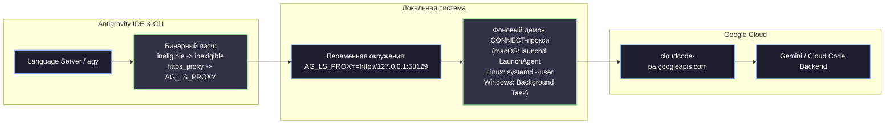

# Antigravity Unlocker (macOS, Windows, Linux)

[](README.md)
[%20%7C%20Intel%20(x86__64)-success)](macos/README.md)
[](Cargo.toml)
[](Cargo.toml)
[](Cargo.toml)
[](src/gui.rs)

Разблокировка Antigravity IDE и CLI в России и регионах с ограничениями без VPN, без смены региона аккаунта Google и без внешних платных сервисов.

Кроссплатформенная утилита для **macOS** (Apple Silicon M1/M2/M3/M4 и Intel x86_64), **Windows** (x86_64) и **Linux** (x86_64, aarch64), позволяющая любому аккаунту Google использовать все возможности экосистемы Antigravity.

> [!NOTE]
> Начиная с версии **2.12.2** анлокер работает как нативное графическое приложение (GUI на базе egui/eframe) с понятными переключателями. Все операции выполняются один раз. При обновлении Antigravity утилита автоматически повторно накладывает патчи. Все изменения полностью обратимы в один клик.

---

## Поддерживаемые платформы

| Платформа | Архитектура | Механизм обхода | Фоновый сервис | Права администратора |
| :--- | :--- | :--- | :--- | :--- |
| **macOS** | Apple Silicon (arm64), Intel (x86_64) | Local CONNECT Proxy + бинарный патч + auto-codesign | LaunchAgent (`launchd`) | **Не требуются** (Unprivileged) |
| **Windows** | x86_64 | NRPT DNS + Local CONNECT Proxy | Планировщик задач (Logon Task) | Нужны для правил NRPT |
| **Linux** | x86_64, aarch64 | Local CONNECT Proxy + бинарный патч | systemd user unit | **Не требуются** (Unprivileged) |

---

## Архитектура работы



### Как это работает:
1. **Снятие регионального флага (Binary Patch):** в исполняемых файлах `language_server` и `agy` строковый дескриптор ответа protobuf `ineligible` заменяется на `inexigible`. Клиент перестает отклонять авторизацию пользователей из неподдерживаемых регионов.
2. **Изолированный прокси (AG_LS_PROXY):** вместо глобальной переменной `https_proxy` (которая ломала бы сторонний софт, Git, Docker и браузеры) внедряется изолированная переменная `AG_LS_PROXY`. Только пропатченный Antigravity направляет свои запросы через локальный прокси.
3. **Локальный CONNECT-прокси:** легковесный прокси-сервер поднимается на порту `127.0.0.1:53129` и туннелирует вызовы к `cloudcode-pa.googleapis.com`, обходя ошибку HTTP 400.
4. **Автоматический ad-hoc codesign на macOS:** на Apple Silicon изменение любого байта в Mach-O файле нарушает цифровую подпись, из-за чего подсистема AMFI (Apple Mobile File Integrity) моментально убивает процесс (`SIGKILL`). Анлокер автоматически выполняет ad-hoc переподпись (`codesign --force -s -`), сохраняя запуск бинарников.

---

## Быстрый старт на macOS

### Вариант 1: Загрузка готового установщика .dmg (Рекомендуется)

Скачайте готовый `.dmg` или `.zip` из раздела [Releases (v2.13.0 macOS)](https://github.com/Fuheshka/Antigravity-Unlocker/releases/latest):
1. Откройте `Antigravity-Unlocker-macOS.dmg`.
2. Перетащите `Antigravity Unlocker.app` в папку **«Программы»** (`/Applications`).
3. Запустите приложение из Spotlight или Launchpad.

### Вариант 2: Сборка и установка из исходников в 1 команду

```bash
# Клонируйте репозиторий:
git clone https://github.com/Fuheshka/Antigravity-Unlocker.git
cd Antigravity-Unlocker

# Запустите скрипт сборки и установки в /Applications:
./macos/install.sh
```

Скрипт автоматически:
1. Соберет оптимизированный бинарник под текущую архитектуру (arm64 или x86_64).
2. Сформирует нативный macOS бандл `Antigravity Unlocker.app` с иконкой и `Info.plist`.
3. Применит ad-hoc цифровую подпись.
4. Скопирует приложение в `/Applications` (или в `~/Applications`).
5. Снимет флаги карантина macOS Gatekeeper.

### Вариант 2: Запуск без установки в `/Applications`

```bash
./macos/launch.sh
```

### Вариант 3: Сборка напрямую через Cargo

```bash
cargo build --release
./target/release/ag_unlocker
```

> [!TIP]
> Если macOS при первом запуске предупреждает о непроверенном разработчике, выполните:
> ```bash
> xattr -cr "/Applications/Antigravity Unlocker.app"
> ```

---

## Быстрый старт на Windows и Linux

### Windows:
1. Скачайте `ag_unlocker.exe` из раздела [Releases](https://github.com/confeden/Antigravity/releases).
2. Нажмите правой кнопкой мыши → **«Запуск от имени администратора»** (права требуются для добавления правил NRPT DNS).
3. Введите лицензионный ключ и включите оба тумблера.

### Linux:
1. Соберите проект: `cargo build --release`.
2. Запустите `./target/release/ag_unlocker`.
3. Права root не требуются: фоновый сервис регистрируется как пользовательский systemd unit (`systemctl --user`).

---

## Где взять ключ доступа?

Для активации функций разблокировки используется бесплатный ключ доступа из официального сообщества:
- Telegram-канал (в закрепленных сообщениях): [t.me/nova_txt](https://t.me/nova_txt/69864)
- В интерфейсе программы предусмотрена удобная кнопка, открывающая нужный пост в один клик.

---

## Что находится в окне программы

* **«Разблокировать вход в аккаунт»** - патчит найденные бинарники Antigravity. В списке ниже отображаются обнаруженные каталоги установки. Кнопка с иконкой карандаша позволяет указать нестандартный каталог вручную.
* **«Автопатч после обновления Antigravity»** - запускает фоновый watchdog, отслеживающий появление обновлений IDE и автоматически применяющий патч к новым версиям.
* **«Обход ошибки 400»** - активирует маршрутизацию трафика:
  * **Локальный прокси (macOS, Linux, Windows)** - фоновый сервис на `127.0.0.1:53129`.
  * **Обход через DNS (Windows)** - резолверы со списком доверенных DNS-провайдеров.
  * **Встроенные выходы и свой HTTP-прокси** - маршрутизация через ваш собственный прокси-сервер при необходимости.

---

## Что программа меняет в операционной системе

Все внесенные изменения строго обратимы:

1. **Бинарные файлы Language Server и CLI** (`language_server*`, `agy`):
   - Заменяются две строки фиксированной длины:
     `ineligible` → `inexigible`
     `https_proxy` → `AG_LS_PROXY`
   - Структура, секции и смещения Mach-O/PE/ELF файлов остаются идентичными оригиналу.
2. **Переменная окружения `AG_LS_PROXY`**:
   - На macOS: устанавливается в сессии пользователя через `launchctl setenv AG_LS_PROXY` (наследуется приложениями из Dock/Spotlight) и прописывается в `~/.zprofile` / `~/.zshrc`.
   - Не затрагивает стандартную переменную `HTTPS_PROXY`.
3. **Фоновый демон прокси**:
   - macOS: `~/Library/LaunchAgents/com.antigravity.unlocker.proxy.plist`.
   - Linux: `~/.config/systemd/user/ag_unlocker_proxy.service`.
   - Windows: запись в планировщике задач `\Antigravity Unlocker Proxy`.
4. **Сетевые правила DNS**:
   - На Windows создаются правила NRPT только для хостов `cloudcode-pa.googleapis.com` и `daily-cloudcode-pa.googleapis.com`.
   - На macOS и Linux глобальные настройки DNS вообще не изменяются.

---

## Проверка и диагностика

### Проверка работы локального прокси
В окне терминала выполните команду:
```bash
curl -I -x http://127.0.0.1:53129 https://www.google.com
```
Ожидаемый ответ: `HTTP/1.1 200 Connection Established` и затем `HTTP/2 200`.

### Проверка статуса LaunchAgent на macOS
```bash
launchctl list | grep antigravity
```

### Ручной перезапуск или отключение LaunchAgent
```bash
# Остановить и выгрузить сервис:
launchctl unload ~/Library/LaunchAgents/com.antigravity.unlocker.proxy.plist

# Запустить снова:
launchctl load ~/Library/LaunchAgents/com.antigravity.unlocker.proxy.plist
```

---

## Разработка и тестирование

Проект написан на чистом Rust (2021 edition) без тяжелых зависимостей.

```bash
# Запуск полного набора unit и интеграционных тестов (215 тестов):
cargo test

# Сборка debug-версии:
cargo build

# Сборка релизной версии под текущую ОС:
cargo build --release
```

---

## Безопасность и открытость

- **100% Open Source:** весь исходный код доступен для независимого аудита прямо в этом репозитории.
- **Никакой телеметрии:** программа не собирает статистику, не передает токены авторизации Google и не производит скрытых сетевых соединений.
- **Откат в один клик:** отключение любого тумблера в GUI мгновенно возвращает оригинальные файлы и удаляет системные службы.

Официальный Telegram проекта: [t.me/nova_txt](https://t.me/nova_txt)

